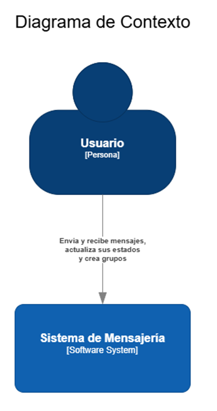
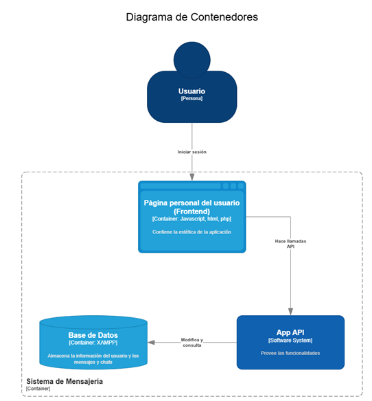
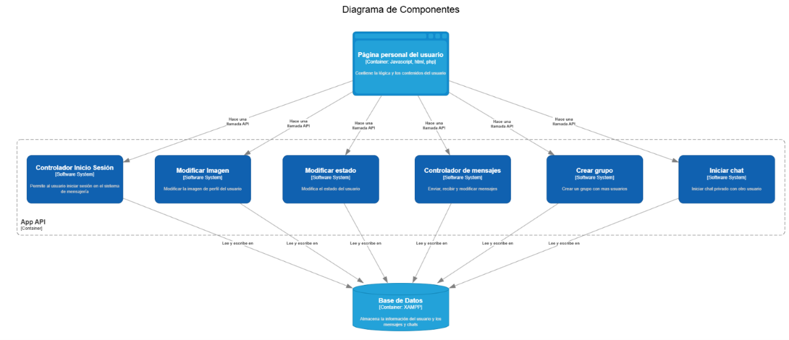
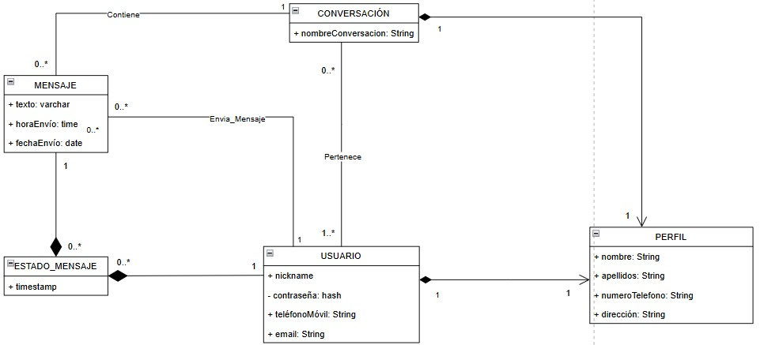
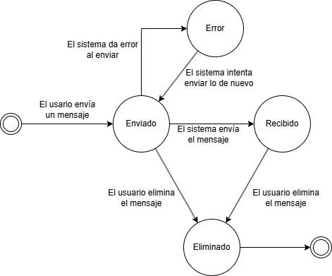
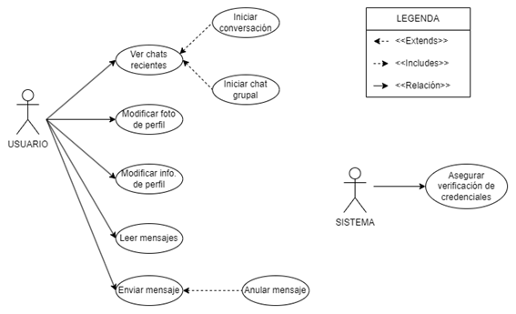

# Grupo 1 - Aplicación de mensajería - Back
`Integrantes`: Luz Salvá, Laura Cavero, Juan Francisco Riera, Constantino Pérez

# Introducción
Este proyecto consiste en una aplicación de mensajería que permite a los usuarios registrarse, iniciar sesión y participar en conversaciones privadas o grupales. Está compuesto por un backend desarrollado en **Spring Boot** y un frontend basado en **React**, trabajando juntos para ofrecer una experiencia de comunicación fluida y segura.

## Historias de usuario
A la hora de tomar decisiones sobre la priorización de las historias de usuario hemos tenido en cuenta la jerarquía de 
implementación, es decir, la funcionalidad equivalente que esté al principio de la cadena de acciones para el 
funcionamiento base de la aplicación irá por encima de las siguientes dependientes de ésta.

**H.U.1.x Inicio de sesión**

1. Como usuario me gustaría registrarme en la aplicación para poder usar en un futuro sus funcionalidades.
2. Como usuario me gustaría iniciar sesión en la aplicación para poder usar sus funcionalidades.
3. Como sistema me gustaría proteger la privacidad de las conversaciones para evitar accesos no autorizados a los mensajes.

**H.U.2.x Home-Page**

1. Como usuario me gustaría tener en la pantalla de inicio todos los chats ordenados por mensajes más recientes para poder contestar más rápido.
2. Como usuario me gustaría poder iniciar una conversación con otro usuario para tener una conversación.
3. Como usuario me gustaría poder iniciar un chat grupal para poder mantener una conversación con más de una persona a la vez.

**H.U.3.x Chats**

1. Como usuario me gustaría enviar mensajes a otro usuario para poder hablar con otras personas por texto.
2. Como usuario me gustaría recibir mensajes de otros usuarios para poder mantener una conversación.
3. Como usuario me gustaría anular un mensaje que ya he enviado para que no quede constancia en la conversación.

**H.U.4.x Perfil**

1. Como usuario me gustaría poder modificar mi foto de perfil para tener una cuenta más personalizada.
2. Como usuario me gustaría poder modificar mi información de perfil para poder tener una cuenta más personalizada.

## Modelo C4

### Nivel 1

### Nivel 2

### Nivel 3

## Modelo de datos

## Diagrama de estados

## Diagrama de casos de uso
El Usuario está registrado en la aplicación y como solo puede tomar acciones una vez iniciado sesión viene intrínseco 
el significado es su rol. Para poder ver los chats recientes, modificar tu foto e información de perfil es necesario 
haber iniciado sesión. Una vez ves los chats recientes puedes iniciar una conversación o un chat grupal. Para enviar un 
mensaje tienes que haber iniciado la conversación antes, pero no es necesario enviar ningún mensaje en una nueva 
conversación creada. Una vez enviado el mensaje lo puedes anular. Para diferenciar entre los mensajes recibidos y 
enviados en una conversación tiene que haber mensajes en esta.

El Sistema es el encargado de persistir los mensajes en la aplicación, notificar un error de envío y asegurar la 
verificación de credenciales.

## Backend

El backend actúa como el núcleo de la aplicación, manejando la lógica de negocio y la persistencia de datos. Entre sus principales responsabilidades se encuentran:

- **Autenticación y Autorización**: Gestiona el registro e inicio de sesión utilizando JWT (JSON Web Tokens) para garantizar la seguridad de las sesiones.
- **Gestión de Conversaciones**: Permite crear y gestionar conversaciones privadas y grupales entre los usuarios.
- **Manejo de Mensajes**: Facilita el envío, recuperación y eliminación de mensajes dentro de las conversaciones.
- **Registro de Lecturas**: Marca mensajes como leídos para rastrear la interacción de los usuarios.
- **Base de Datos**: Almacena la información en una base MySQL, asegurando la persistencia de datos.

### Tecnologías Utilizadas
- **Spring Boot**: Framework para construir aplicaciones backend de forma escalable y eficiente.
- **MySQL**: Base de datos relacional utilizada para almacenar usuarios, mensajes y conversaciones.
- **Xampp**: Herramienta que facilita la configuración y despliegue del entorno.

## Frontend

El frontend es la interfaz de usuario de la aplicación, desarrollada con **React** y diseñada con **Material-UI** para ofrecer una experiencia moderna y responsiva. Proporciona las siguientes funcionalidades:

- **Registro e Inicio de Sesión**: Formularios amigables que interactúan con el backend para registrar usuarios o iniciar sesión.
- **Visualización de Conversaciones**: Interfaz intuitiva para mostrar y gestionar conversaciones activas.
- **Envío de Mensajes**: Permite a los usuarios enviar mensajes de forma sencilla y rápida.
- **Gestión de Sesión**: Utiliza el token JWT para autenticar y mantener sesiones activas.

## Arquitectura
La arquitectura hexagonal, es un estilo de diseño de software que promueve la separación de las preocupaciones y la independencia de la lógica de negocio respecto a los
detalles de implementación, como bases de datos, interfaces de usuario, etc. Esta arquitectura facilita la prueba y el
mantenimiento del software, permitiendo que los componentes internos del sistema no dependan de los externos.

### Componentes de la Arquitectura Hexagonal

1. **Dominios y Entidades**: Representan la lógica de negocio. En el proyecto, estas son las
   clases `User`, `Profile`, `Conversation`, `Message` y `MessageReadReceipt`.

2. **Servicios**: Contienen la lógica de negocio y las operaciones que se pueden realizar sobre las entidades. 

3. **Puertos**: Interfaces que definen las operaciones que los servicios necesitan para interactuar con la base de datos.

4. **Adaptadores**: Implementaciones de los puertos que conectan la lógica de negocio con las tecnologías específicas.

5. **Controladores**: Manejan las solicitudes entrantes y utilizan los servicios para procesarlas. 

### Software Boundary

El software boundary en la arquitectura hexagonal se refiere a la separación clara entre la lógica
de negocio y los detalles de implementación. Los puertos y adaptadores actúan como la frontera entre el núcleo de la
aplicación y el mundo exterior.

## Seguridad
En esta aplicación de mensajería, la seguridad en la aplicación se basa en la autenticación de usuarios y la 
autorización de las diferentes operaciones que pueden realizar. Para ello, se ha implementado un sistema de 
autenticación basado en tokens JWT (JSON Web Tokens) que se generan al autenticar un usuario y se utilizan para acceder 
a las diferentes funcionalidades durante la navegación en la aplicación.

### Autenticación
La autenticación de los usuarios se realiza mediante un endpoint de login que recibe el nombre de usuario y la contraseña
del usuario y, si son correctos, devuelve un token JWT que se utilizará para acceder a las funcionalidades de la
aplicación. Este token se envía en la cabecera de las peticiones a los diferentes endpoints que requieren autenticación.
- `SecurityConfig`: Clase de configuración de seguridad que define cómo se autentican los usuarios y cómo se generan los
tokens JWT.
  - **bCryptPasswordEncoder**: Método para encriptar las contraseñas de los usuarios.
  - **configureHttpSecurity**: Método para configurar la seguridad de la aplicación.
  - **authenticationManager**: Método para obtener el `AuthenticationManager`.
- `JwtRequestFilter`: Filtro que intercepta las peticiones y comprueba si el token JWT es válido.
- `JwtUtil`: Clase de utilidad para generar y validar tokens JWT.
  - **generateToken**: Método para generar un token JWT.
  - **extractUsername**: Método para extraer el nombre de usuario del token JWT.
  - **isTokenValid**: Método para validar un token JWT.
  - **isTokenExpired**: Método para comprobar si un token JWT ha expirado.

## Registro y Login
En esta aplicación de mensajería, los usuarios pueden registrarse y autenticarse para acceder a las diferentes 
funcionalidades que ofrece la aplicación. Para ello, una vez registrado y después de un login satisfactorio, se generará 
un token que, a lo largo de la sesión, se utilizará para controlar los accesos permitidos a la información que 
proporcionan los diferentes API endpoints.

### Modelo
Se han definido dos clases: `User` y `Profile`. La primera representa un usuario y la segunda su perfil. Ambas clases 
están relacionadas por un ID único;
- `User`: Clase que representa un usuario. Contiene un ID único, un nombre de usuario, una contraseña, 
un correo electrónico. Así como un perfil asociado (mediante una relación uno a uno con la clase `Profile`) y el listado 
de conversaciones a las cuales pertenece.

### UserRepository
En el proyecto se han definido dos repositorios para interactuar con la base de datos, concretamente la información
relacionada con los usuarios y perfiles;
- `UserRepository`: Interfaz que extiende `JpaRepository` y define métodos para interactuar con la información en la 
base de datos relacionada con los usuarios.
  - **findByUsername**: método para buscar un usuario por su nombre de usuario.

### Puertos y Adaptadores
En el proyecto se han definido dos puertos relacionados con usuarios y perfiles con la finalidad de abstraer las 
operaciones de persistencia de datos, permitiendo que la implementación pueda variar sin afectar al resto del sistema. 
Esto facilita la inyección de dependencias y el uso de diferentes tecnologías de persistencia. 
Además de sus correspondientes adaptadores para interactuar con la base de datos respetando la arquitectura hexagonal;
- `UserPort`: Interfaz para interactuar con los datos del usuario en el sistema.
- `UserJpaAdapter`: Implementación de `UserPort` que utiliza `UserRepository` para interactuar con la base de datos.

### UserService
En el proyecto se han definido dos servicios para manejar la lógica de negocio relacionada con la información 
relacionada con los usuarios y perfiles;
- `UserService`: Interfaz que define métodos para interactuar con los usuarios, como registrar un nuevo usuario, buscar
un usuario por su nombre de usuario, y buscar un usuario por su ID.
- `UserServiceImpl`: Implementación de `UserService` que utiliza `UserRepository` para interactuar con la base de datos.
  - **loadUserByUsername**: método para cargar un usuario por su nombre de usuario.
  - **register**: método para registrar un nuevo usuario.
  - **validatePassword**: método para validar la contraseña de un usuario.
  - **findByUsername**: método para buscar un usuario por su nombre de usuario.

### Controladores
En el proyecto se han definido dos controladores para manejar las operaciones relacionadas con el login de un usuario 
y el acceso a sus correspondientes perfiles de forma segura;
- `AuthController`: Controlador que maneja las operaciones relacionadas con la autenticación de usuarios, como registrar
  un nuevo usuario y autenticar un usuario.
  - **register**: método para registrar un nuevo usuario.
  - **login**: método para autenticar un usuario ya registrado. este método **devuelve un token JWT** que se utilizará para 
    acceder a las funcionalidades de la aplicación.

## Conversaciones
En esta aplicación de mensajería, los usuarios pueden iniciar y gestionar tanto conversaciones privadas como grupales. 
A continuación, se detalla cómo se manejan las conversaciones en el proyecto siguiendo una arquitectura hexagonal:

### Modelo 
- `Conversation`: Clase que representa una conversación. Contiene un ID único, un nombre y una lista de participantes.

### ConversationRepository
- **save y findById**: métodos para guardar y buscar conversaciones en la base de datos. Es heredado de `JpaRepository`.
- **findByConversationName**: método para buscar una conversación (grupal) por su nombre.
- **findPrivateConversation**: método para buscar una conversación privada entre dos usuarios.

### Puertos y Adaptadores
- `ConversationPort`: define los métodos para interactuar con las conversaciones, como buscar por ID, guardar una 
    conversación, y encontrar conversaciones privadas o grupales.
- `ConversationJpaAdapter`: implementa `ConversationPort` y utiliza `ConversationRepository` para interactuar con la 
    base de datos.

### ConversationService
Este servicio maneja la creación y recuperación de conversaciones privadas y grupales.
`ConversationServiceImpl` utiliza el puerto ConversationPort para interactuar con el repositorio de conversaciones.
- **isUserInConversation**: método para verificar si un usuario está en una conversación.
- **getConversationById**: método para obtener una conversación por su ID.
- **createPrivateConversation**: método para crear una conversación privada entre dos usuarios.
- **getPrivateConversation**: método para obtener una conversación privada entre dos usuarios.
- **createGroupConversation**: método para crear una conversación grupal.
- **getGroupConversation**: método para obtener una conversación grupal por su nombre.

### ConversationsController
Este controlador maneja las operaciones relacionadas con la creación y recuperación de conversaciones privadas y grupales 
utilizando el servicio `ConversationService` para realizar estas operaciones.

## Mensajes
En esta aplicación de mensajería, los usuarios pueden enviar mensajes a conversaciones privadas y grupales.
A continuación, se detalla cómo se manejan los mensajes en el proyecto siguiendo una arquitectura hexagonal:

### Modelo
- `Message`: Clase que representa un mensaje. Contiene un ID único, el contenido del mensaje (texto), la fecha en que se envió, 
    el ID de la conversación a la que pertenece y el ID del usuario que lo envió.

### MessageRepository
- **save y findById**: métodos para guardar y buscar mensajes en la base de datos. Es heredado de `JpaRepository`.
- **findByConversationIdAndSentDate**: método para buscar mensajes por ID de conversación y fecha de envío.

### Puerto y Adaptador
- `MessagePort`: define los métodos para interactuar con los mensajes, como buscar por ID, guardar un mensaje, eliminar un mensaje y encontrar 
    mensajes por ID de conversación y fecha de envío.
- `MessageJpaAdapter`: implementa `MessagePort` y utiliza `MessageRepository` para interactuar con la base de datos.

### MessageService
Este servicio maneja la creación y recuperación de mensajes.
`MessageServiceImpl` utiliza el puerto MessagePort para interactuar con el repositorio de mensajes.
- **sendMessage**: método para enviar un mensaje a una conversación.
- **deleteMessageById**: método para eliminar un mensaje.
- **getMessagesByConversation**: método para obtener mensajes por ID de conversación y fecha de envío.
- **markMessageAsRead**: método para marcar un mensaje como leído.

### MessagesController
Este controlador maneja las operaciones relacionadas con el envío y recuperación de mensajes utilizando el servicio
`MessageService` para realizar estas operaciones.

## Lectura de Mensajes
En esta aplicación de mensajería, cuando un usuario lee un mensaje, se marca como leído guardando un registro de lectura.

### Modelo
- `MessageReadReceipt`: Clase que representa un registro de lectura de un mensaje. Contiene un ID único, el ID del 
mensaje leído, el ID del usuario que lo leyó junto a la fecha y hora de lectura.

### MessageReadReceiptRepository
- **save y findById**: métodos para guardar y buscar lecturas en la base de datos. Es heredado de `JpaRepository`.

### Puerto y Adaptador
- `MessageReadReceiptPort`: define los métodos para interactuar con los registros de lectura, como guardar.
- `MessageReadReceiptJpaAdapter`: implementa `MessageReadReceiptPort` y utiliza `MessageReadReceiptRepository` para interactuar con la base de datos.

### Servicio 
Definido en `MessagingService`. 
- **markMessageAsRead**: método para marcar un mensaje como leído. `MessagingServiceImpl` lo implementa.

### Controlador
Definido en `MessagingController`.
- **markMessageAsRead**: método para marcar un mensaje como leído dado el ID del mensaje. 

## Perfiles de Usuario
En esta aplicación de mensajería, cada usuario tiene un perfil asociado que almacena información personal y de contacto. 
A continuación, se detalla cómo se gestionan los perfiles en el proyecto siguiendo una arquitectura hexagonal:

### Modelo
- **`Profile`**: Clase que representa un perfil de usuario. Contiene los siguientes atributos:
  - **`id`**: Identificador único del perfil.
  - **`firstName`** y **`lastName`**: Nombre y apellidos del usuario con valores predeterminados.
  - **`phoneNumber`**: Número de teléfono.
  - **`address`**: Dirección del usuario.
  - **`user`**: Relación uno a uno con la clase `User`, que vincula el perfil al usuario correspondiente.

### ProfileRepository
- **save y findById**: Métodos heredados de `JpaRepository` para guardar y buscar perfiles en la base de datos.
- **findByUserId**: Método personalizado para buscar un perfil basado en el ID del usuario.

### Puerto y Adaptador
- **ProfilePort**: Define los métodos para interactuar con los perfiles:
  - **findByUserId**: Buscar un perfil por el ID del usuario.
  - **saveProfile**: Guardar un perfil en la base de datos.
- **ProfileJpaAdapter**: Implementa `ProfilePort` utilizando `ProfileRepository` para interactuar con la base de datos.

### ProfileService
Este servicio maneja la lógica de negocio relacionada con los perfiles de usuario.
- **getProfileByUsername**: Obtiene el perfil de un usuario utilizando su nombre de usuario.
- **updateProfileByUsername**: Actualiza el perfil del usuario autenticado con nuevos datos.

### ProfileController
Este controlador maneja las operaciones relacionadas con los perfiles, permitiendo su gestión mediante endpoints REST:
- **`GET /api/profiles/me`**: Devuelve el perfil del usuario autenticado.
- **`PUT /api/profiles/me`**: Permite al usuario autenticado actualizar su perfil con los datos proporcionados.

### Seguridad
- El acceso a los endpoints relacionados con los perfiles está protegido mediante autenticación basada en JWT.
- El token JWT es validado por el filtro `JwtRequestFilter` antes de acceder a los recursos protegidos.
- Las rutas para gestionar los perfiles se configuran como autenticadas en `SecurityConfig`.

### Flujo General
1. **Autenticación**: El usuario inicia sesión y obtiene un token JWT.
2. **Consulta del Perfil**:
   - Se utiliza el token para obtener el nombre de usuario autenticado.
   - Se consulta el servicio para recuperar el perfil vinculado al usuario.
3. **Actualización del Perfil**:
   - El controlador recibe los nuevos datos del perfil en el cuerpo de la solicitud.
   - El servicio valida y guarda los datos actualizados utilizando el puerto `ProfilePort`.

Este diseño modular garantiza una gestión eficiente y segura de los perfiles, permitiendo una fácil integración con otras funcionalidades de la aplicación.

## API ENDPOINTS
### Registro [x]
Se crea un perfil default automáticamente con información placeholder. No puede coincidir ni el usuario ni el correo existente en la base de datos.
- Opción: POST
- URL: http://localhost:8080/auth/register
- Headers:
  - Key: Content-Type
  - Value: application/json
- Body: opción JSON
  - Raw:
    {"username": "nuevoUsuario",
    "password": "miContraseñaSegura",
    "email": "correo@example.com",
    "name": "Nombre Completo"}

### LogIn [x]
Devolverá un token que se debe conservar.
- Opción: POST
- URL: http://localhost:8080/auth/login
- Params:
  - Key: username
  - Value: nuevoUsuario

  - Key: password
  - Value: miContraseñaSegura

### Modificar Perfil [x]
Solo puedes modificar tu perfil si te has loggeado previamente.
- Opción: PUT
- URL: http://localhost:8080/api/profiles/me
- Headers:
  - Key: Authorization
  - Value: El token generado en el login

  - Key: Content-Type
  - Value: application/json
- Body:
  {
  "firstName": "a",
  "lastName": "s",
  "phoneNumber": "123",
  "address": "c"
  }

### Iniciar Conversación Individual [x]
Los usuarios deben estar registrados previamente.
- Opción: POST
- URL: http://localhost:8080/api/conversations/private-conversation
- Headers:
  - Key: Authorization
  - Value: El token generado en el login

  - Key: Content-Type
  - Value: application/x-www-form-urlencoded
- Body: opción x-www-form-urlencoded
  - Key: user2Username
  - Value: Username del usuario con el que iniciar la conversación
    
### Iniciar Conversación Grupal [x]
Los usuarios deben estar registrados previamente
- Opción: POST
- URL: http://localhost:8080/api/conversations/group-conversation
- Params:
  - conversationName: Nombre de la conversación grupal
  - participants: username1,username2,username3
- Headers:
  - Key: Authorization
  - Value: El token generado en el login

### Cargar Conversación Grupal Completa [X]
El usuario (que ha iniciado sesión) debe pertenecer a dicha conversación
- Opción: GET
- URL: http://localhost:8080/api/conversations/group-conversation
- Params:
  - conversationName: nombre de la conversación grupal que se desea cargar 
- Headers:
  - Key: Authorization
  - Value: El token generado en el login

### Cargar Conversación Individual Completa
El usuario (que ha iniciado sesión) debe pertenecer a dicha conversación
- Opción: GET
- URL: http://localhost:8080/api/conversations/private-conversation
- Params:
  - Key: user2Username
  - Value: nombre del otro usuario de la conversación
- Headers:
  - Key: Authorization
  - Value: El token generado en el login

### Enviar Mensaje [x]
La conversación debe estar iniciada previamente y el mensaje lo manda el usuario loggeado.
- Opción: POST
- URL: http://localhost:8080/api/messaging/message
- Headers:
  - Key: Authorization
  - Value: El token generado en el login

  - Key: Content-Type
  - Value: application/x-www-form-urlencoded
- Body: opción x-www-form-urlencoded
  - Key: conversationId
  - Value: Una conversación donde pertenezca el usuario loggeado

  - Key: content
  - Value: Texto del mensaje a enviar

### Cargar mensajes específicos de una conversación
El usuario (que ha iniciado sesión) debe pertenecer a dicha conversación.
El mensaje debe existir en esa conversación. 
- Opción: GET
- URL:http://localhost:8080/api/messaging/conversation/{id de la conversación}/messages
- Params:
  - Key: sentDate
  - Value: fecha en la que se envió el mensaje en formato aaaa-mm-dd
- Headers:
  - Key: Authorization
  - Value: El token generado en el login

### Eliminar mensaje [x]
El mensaje debe existir previamente y solo puedes borra mensajes que han sido enviados por el usuario loggeado
- Opción: http://localhost:8080/api/messaging/message/{messageId}
- URL: DELETE
- Headers:
  - Key: Authorization
  - Value: El token generado en el login
  
### Lectura de mensaje [x]
El mensaje debe estar creado previamente y el usuario que lee el mensaje
debe pertenecer a la conversación.
- Opción: POST
- URL: http://localhost:8080/api/messaging/mark-as-read/{messageId}
- Headers:
  - Key: Authorization
  - Value: El token generado en el login
- Params:
  - Key: username
  - Value: username del usuario (loggeado) que lee el mensaje

## Conclusión
Durante el desarrollo de este proyecto, implementamos satisfactoriamente una aplicación de mensajería utilizando 
Spring Boot, siguiendo la estructura aprendida en clase. Aplicamos el concepto de arquitectura hexagonal explicado 
en clase, lo que nos permitió crear un sistema robusto y mantenible.

La aplicación incluye características de seguridad eficaces, como autenticación y autorización basadas en JWT, 
lo que garantiza un acceso seguro a las funcionalidades de la aplicación.

Definimos modelos integrales para usuarios, perfiles, conversaciones y mensajes, e implementamos repositorios, 
servicios y controladores para administrar estas entidades. El uso de puertos y adaptadores nos permitió abstraer 
la lógica de persistencia, haciendo que el sistema sea más flexible y mantenible.

La aplicación admite el registro de usuarios, el inicio de sesión, la gestión de perfiles y la creación y gestión 
de conversaciones privadas y grupales. Además, los usuarios pueden enviar y recibir mensajes, así como eliminarlos.

En general, este proyecto nos ha permitido poner en práctica el objetivo del curso “Análisis y Diseño de Software”, 
demostrando el uso efectivo de Spring Boot y tecnologías relacionadas para construir una aplicación de mensajería 
segura y escalable, administrando las mejores prácticas en arquitectura y diseño de software.
